# Finance Credit Follow-Up Email Agent

Enterprise-style AI-powered platform for finance credit follow-up operations with deterministic workflow governance, constrained AI communication, human approval controls, dry-run execution, and LangGraph-based orchestration tracing.

## Business Problem

Finance teams need consistent, auditable, and safe overdue payment follow-up workflows. Manual processes are hard to scale, difficult to govern, and often lack operational traceability.

## Key Features

- Deterministic overdue and escalation workflow engine
- Stage-aware AI email generation with structured output validation
- Prompt-injection mitigation and forbidden language checks
- Human approval workflow before any delivery execution
- Dry-run delivery simulation (default-safe mode)
- LangGraph orchestration with pause/resume support
- Full audit trail for workflow, AI, delivery, and orchestration events
- Operations dashboard in Streamlit

## Architecture Overview

- `backend/app/api`: FastAPI route layer
- `backend/app/services`: business/application services
- `backend/app/workflows`: deterministic workflow engine + LangGraph orchestration
- `backend/app/ai`: AI provider abstraction, prompts, validation, sanitization
- `backend/app/delivery`: delivery provider abstraction and dry-run provider
- `backend/app/models`: ORM and Pydantic schemas
- `frontend/streamlit_app.py`: operations dashboard

Detailed diagrams: [docs/architecture_diagrams.md](docs/architecture_diagrams.md)

### System Architecture

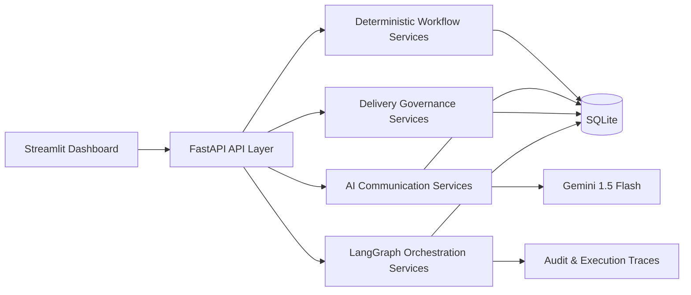

### Workflow Lifecycle Diagram

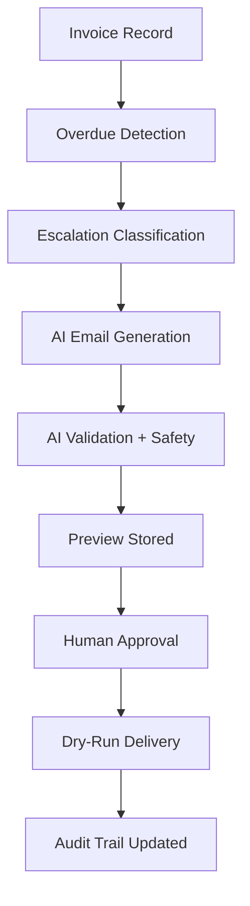

### LangGraph Orchestration Flow

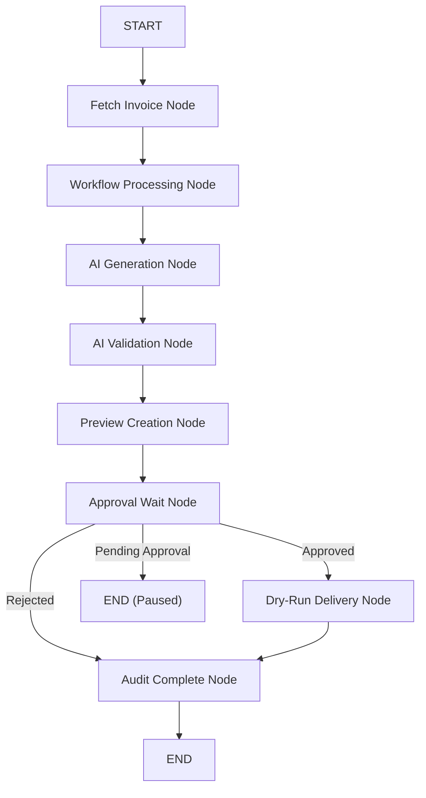

### AI Governance Pipeline

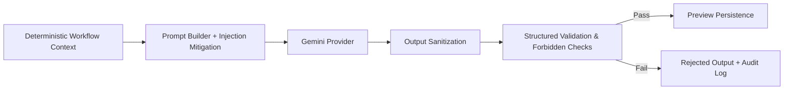

## Workflow Lifecycle

1. Invoice ingestion
2. Overdue detection
3. Escalation classification
4. AI email generation (structured output)
5. AI validation and safety checks
6. Preview creation
7. Human approval/rejection
8. Dry-run delivery execution
9. Audit and orchestration trace updates

## LangGraph Orchestration

- Node-based stateful execution over existing services
- Approval interruption point (`PAUSED_APPROVAL`)
- Resume workflow support after approval decision
- Node transition history with durations and status

Endpoints:

- `POST /orchestration/run/{invoice_id}`
- `POST /orchestration/resume/{invoice_id}`
- `GET /orchestration/trace/{invoice_id}`
- `GET /orchestration/status/{invoice_id}`

## AI Safety and Governance

- Externalized system/stage prompt files
- Structured output schema (`subject`, `email_body`, `tone_used`, `escalation_stage`)
- Hallucination checks against deterministic invoice context
- Forbidden phrase detection (threats, fabricated legal/penalty claims)
- Sanitization and normalization before validation acceptance
- Rejected outputs are logged and never advanced for delivery

## Human Approval Workflow

Delivery statuses:

- `GENERATED`
- `PENDING_APPROVAL`
- `APPROVED`
- `REJECTED`
- `DRY_RUN_SENT`
- `SENT`
- `FAILED`

Safety guardrails:

- Unapproved emails cannot be sent
- Rejected content cannot be sent
- Duplicate dry-run sends are blocked

## Tech Stack

- Frontend: Streamlit
- Backend: FastAPI
- Orchestration: LangGraph
- LLM: OpenAI (gpt-4o-mini default)
- Database: SQLite + SQLAlchemy
- Validation: Pydantic
- Data processing: pandas

## Setup Instructions

1. Create and activate a virtual environment.
2. Install dependencies:

```bash
pip install -r requirements.txt
```

3. Copy environment template:

```bash
copy .env.example .env
```

4. Set `OPENAI_API_KEY` in `.env`.

## Run Locally

Backend:

```bash
python -m uvicorn app.main:app --app-dir backend --reload
```

Frontend:

```bash
python -m streamlit run frontend/streamlit_app.py
```

Optional frontend virtual environment (recommended on Windows):

```bash
python -m venv frontend/.venv
frontend/.venv/Scripts/python.exe -m pip install -r frontend/requirements.txt
frontend/.venv/Scripts/python.exe -m streamlit run frontend/streamlit_app.py
```

Or use helper scripts:

- [scripts/run_backend.ps1](scripts/run_backend.ps1)
- [scripts/run_frontend.ps1](scripts/run_frontend.ps1)
- [scripts/run_all.ps1](scripts/run_all.ps1)

Single-command run (bootstraps venvs if needed):

```bash
powershell -ExecutionPolicy Bypass -File scripts/run_all.ps1
```

## Environment Variables

See [.env.example](.env.example) for full list.

Important variables:

- `DATABASE_URL`
- `BACKEND_URL`
- `OPENAI_API_KEY`
- `OPENAI_MODEL_NAME`
- `OPENAI_TIMEOUT_SECONDS`
- `OPENAI_MAX_RETRIES`

## API Overview

Core:

- `/invoices/*`
- `/workflows/*`
- `/audit`

AI:

- `/ai/generate/{invoice_id}`
- `/ai/generate-overdue-batch`
- `/ai/generated-preview/{invoice_id}`

Delivery:

- `/delivery/approve/{invoice_id}`
- `/delivery/reject/{invoice_id}`
- `/delivery/dry-run-send/{invoice_id}`
- `/delivery/regenerate/{invoice_id}`
- `/delivery/status/{invoice_id}`
- `/delivery/pending-approvals`
- `/delivery/summary`

Orchestration:

- `/orchestration/run/{invoice_id}`
- `/orchestration/resume/{invoice_id}`
- `/orchestration/trace/{invoice_id}`
- `/orchestration/status/{invoice_id}`

## Streamlit Dashboard Overview

- Dashboard metrics and workflow processor
- Workflow stage filtering and legal escalation highlighting
- AI preview generation and validation indicators
- Delivery governance queue and status controls
- Orchestration run/resume/status/trace timeline viewer
- Audit log explorer

## Screenshots

### Dashboard

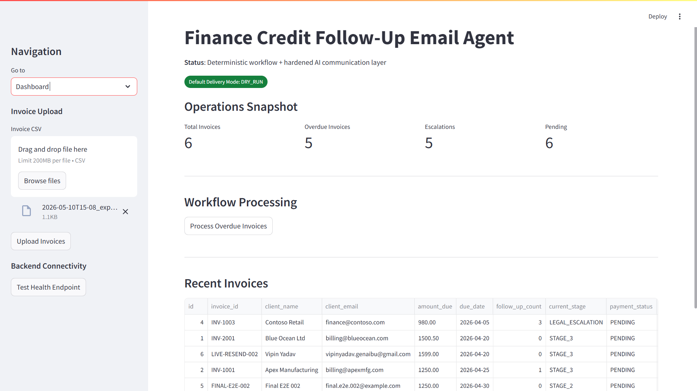

### Invoices

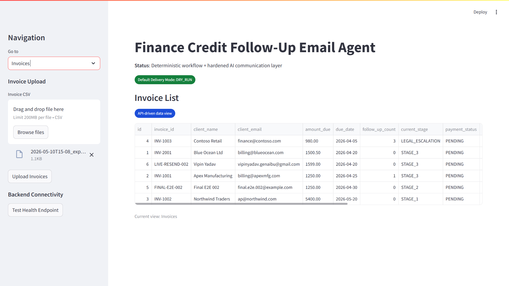

### Workflows

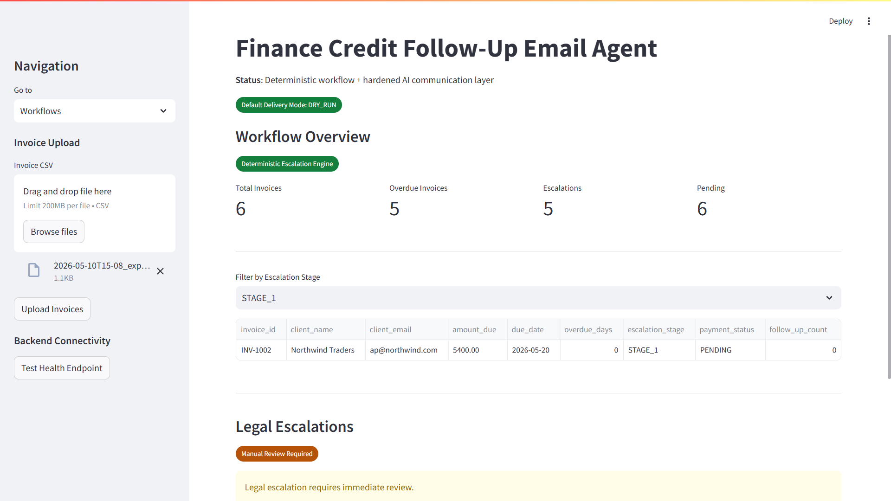

### AI Preview

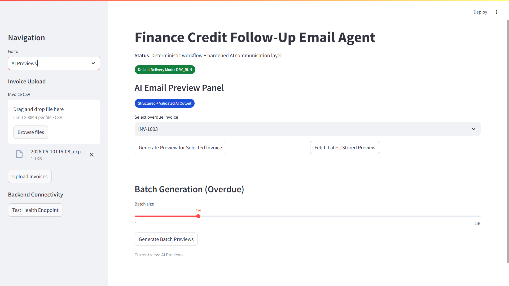

### Delivery

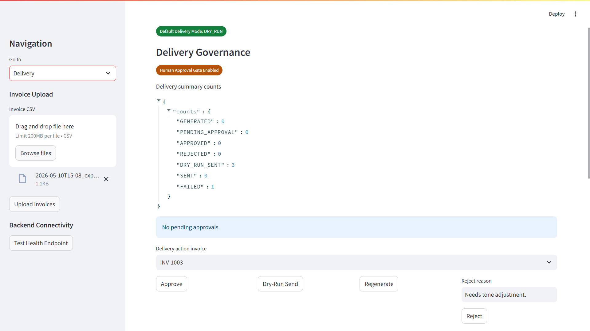

### Orchestration

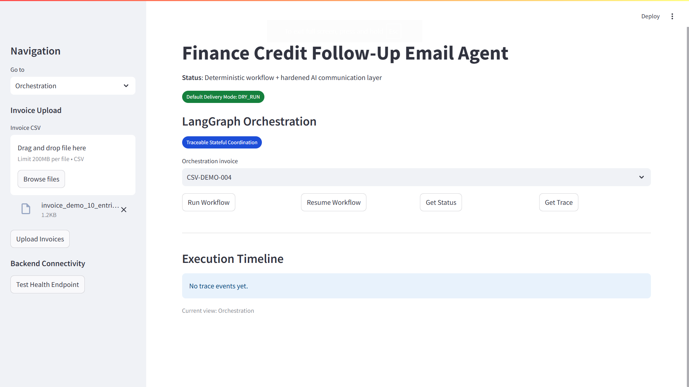

### Audit

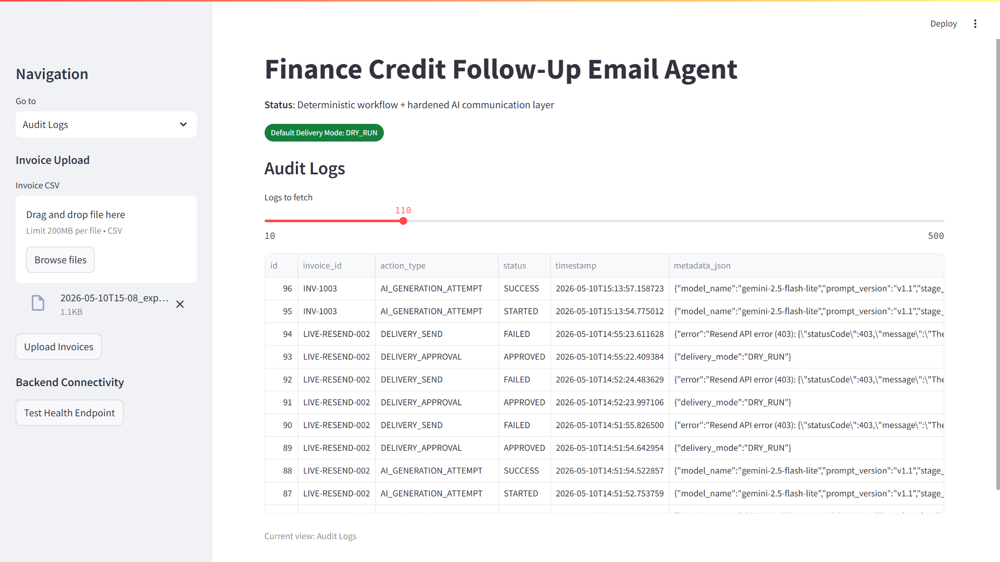

## Deployment Readiness

- Dockerfile: [Dockerfile](Dockerfile)
- Docker Compose: [docker-compose.yml](docker-compose.yml)

Run with Docker:

```bash
docker compose up --build
```

## Demo

- Demo dataset: [data/demo/demo_invoices.csv](data/demo/demo_invoices.csv)
- Demo dataset: [data/demo/test_invoice_data.csv](data/demo/test_invoice_data.csv)
- Captured demo outputs (CSV + JSON): `docs/outputs/`
- AI preview outputs: `docs/outputs/output_aipreview/`
- Workflow stage outputs: `docs/outputs/output_workflow/`

## Future Improvements

- SMTP provider integration (with approval gate retained)
- Persistent orchestration state store (Redis/Postgres)
- Role-based access controls
- Notification and SLA monitoring
- CI pipeline for automated regression tests
