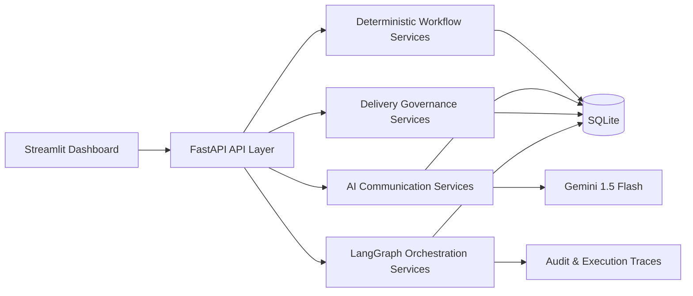
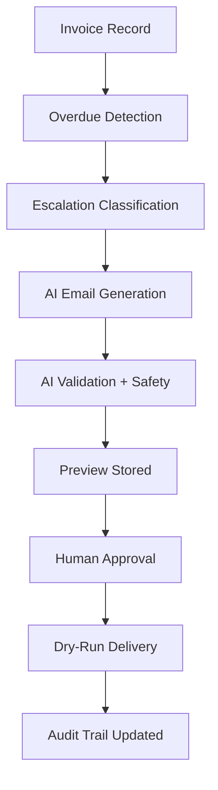
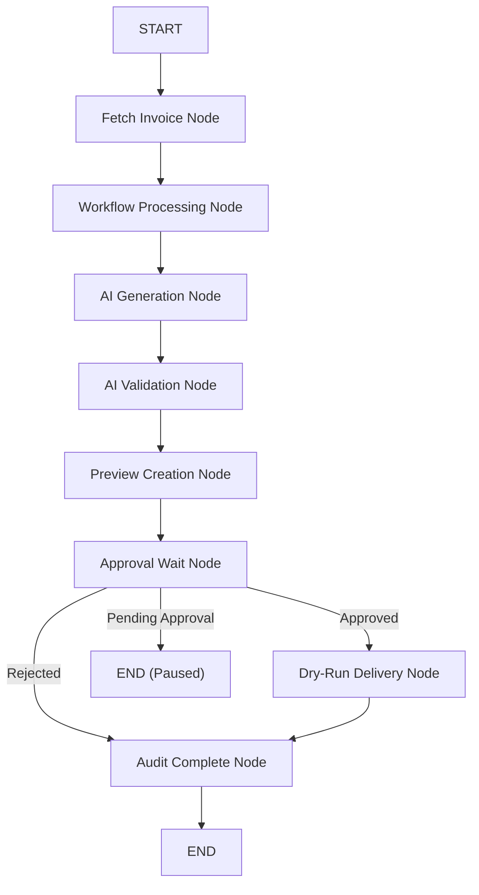
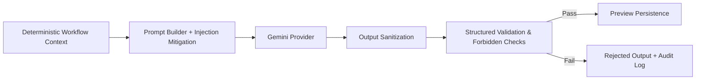

# Architecture Diagrams

## System Architecture

```mermaid
flowchart LR
    UI["Streamlit Dashboard"] --> API["FastAPI API Layer"]
    API --> WF["Deterministic Workflow Services"]
    API --> AI["AI Communication Services"]
    API --> DL["Delivery Governance Services"]
    API --> ORCH["LangGraph Orchestration Services"]
    WF --> DB[(SQLite)]
    AI --> DB
    DL --> DB
    ORCH --> DB
    AI --> GEM["Gemini 1.5 Flash"]
    ORCH --> LOGS["Audit & Execution Traces"]
```

## Workflow Lifecycle

```mermaid
flowchart TD
    INV["Invoice Record"] --> OVR["Overdue Detection"]
    OVR --> STG["Escalation Classification"]
    STG --> GEN["AI Email Generation"]
    GEN --> VAL["AI Validation + Safety"]
    VAL --> PRV["Preview Stored"]
    PRV --> APP["Human Approval"]
    APP --> DRY["Dry-Run Delivery"]
    DRY --> AUD["Audit Trail Updated"]
```

## LangGraph Orchestration Flow

```mermaid
flowchart TD
    S["START"] --> F["Fetch Invoice Node"]
    F --> W["Workflow Processing Node"]
    W --> G["AI Generation Node"]
    G --> V["AI Validation Node"]
    V --> P["Preview Creation Node"]
    P --> A["Approval Wait Node"]
    A -->|Approved| D["Dry-Run Delivery Node"]
    A -->|Pending Approval| E["END (Paused)"]
    A -->|Rejected| C["Audit Complete Node"]
    D --> C
    C --> X["END"]
```

## AI Governance Pipeline

```mermaid
flowchart LR
    CTX["Deterministic Workflow Context"] --> PR["Prompt Builder + Injection Mitigation"]
    PR --> LLM["Gemini Provider"]
    LLM --> SAN["Output Sanitization"]
    SAN --> VLD["Structured Validation & Forbidden Checks"]
    VLD -->|Pass| PV["Preview Persistence"]
    VLD -->|Fail| RJ["Rejected Output + Audit Log"]
```
